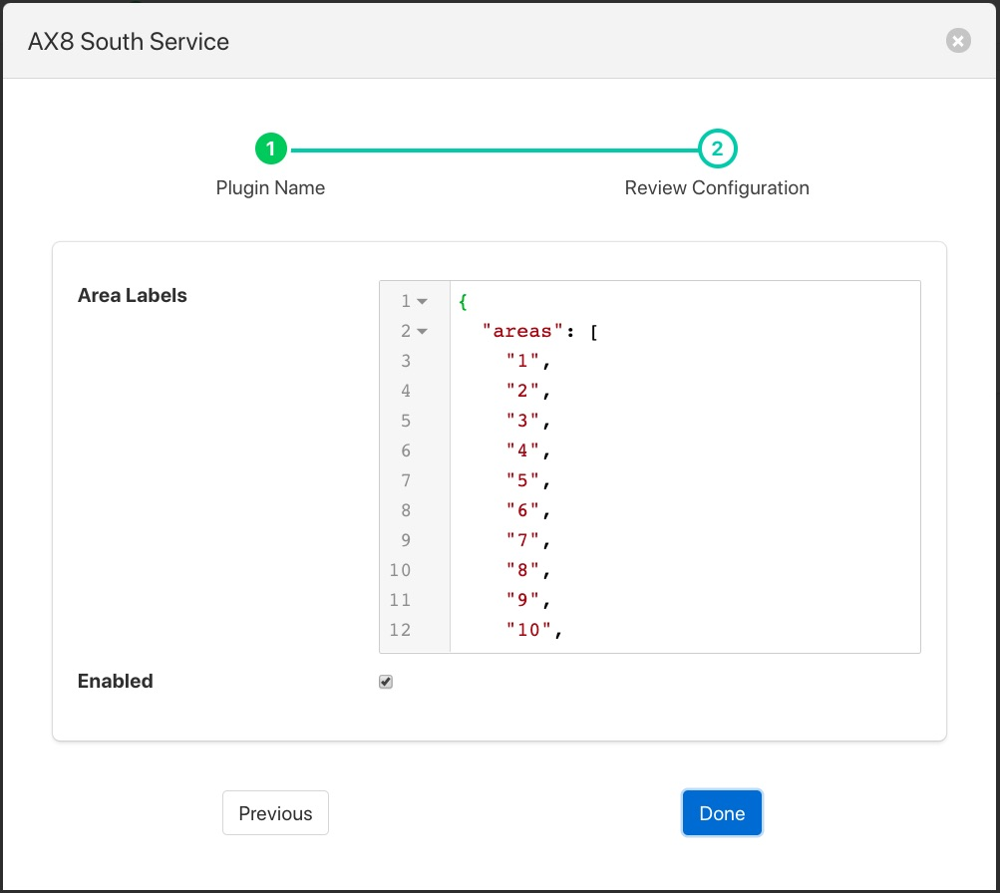

.. Images

.. Links
.. |FlirAX8| raw:: html

   <a href="../fledge-south-FlirAX8/index.html">Flir AX8</a>

Flir Validity Filter
====================

The *fledge-filter-Flir-Validity* plugin is a simple filter that filters out unused boxes and spot temperatures in the Flir temperature data stream. The filter also allows the naming of the boxes such that the data points added to the asset will use these names rather than the default box1, box2 etc.

Adding the filter to a |FlirAX8| south plugin you will receive a configuration screen as below

+------------+
| |validity| |
+------------+

The JSON document *Area Labels* can be used to set the labels to use for each of the boxes and replace the min1, min2 etc. The value of this configuration option is a JSON document that has a single element called *areas* which is a JSON array. Each element in that area is the name to assign to the particular box. The default values would set the name of box1 to simply be 1, box2 to 2 etc.

If we assume we are monitoring a lathe with the camera and taking the temperature of the motor, the bearing and cutting bit using the boxes 1, 2, and 3 in the camera. We wish to rename the first box to be called *Motor*, the second box to be called *Bearing* and the third to be called *Tool*, setting an *areas* array as follows would achieve this.

.. code-block:: JSON

    {
        "areas" : [
            "Motor",
            "Bearing",
            "Tool",
            "4",
            "5",
            "6",
            "7",
            "8',
            "9",
            "10"
          ]
    }

Note that we do not change the boxes 4 to 10 as these are not in use and have not been defined within the area interface. Using the above configuration setting for areas will result in asset names of *minMotor*, *maxMotor* and *averageMotor* being generated for the motor temperature. Similarly the bearing temperatures would be *minBearing*, *maxBearing* and *averageBearing*. The tool would have asset names of *minTool*, *maxTool* and *averageTool*.
